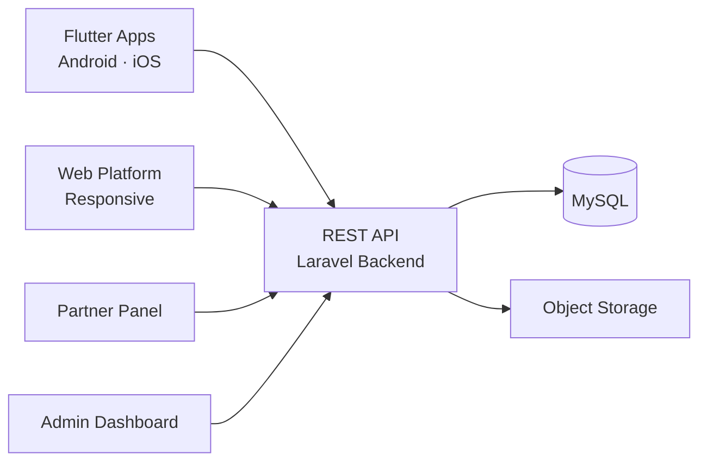

# Binance Clone — White-Label Solution by Miracuves

---

## Table of Contents

1. [Who Is This For?](#who-is-this-for)
2. [How It Works](#how-it-works)
3. [Core Features](#core-features)
4. [Architecture](#architecture)
5. [Revenue Streams](#revenue-streams)
6. [What's Included](#whats-included)
7. [Deployment Timeline](#deployment-timeline)
8. [Why Not Build From Scratch?](#why-not-build-from-scratch)
9. [Market Opportunity](#market-opportunity)
10. [Client Testimonials](#client-testimonials)
11. [FAQ](#faq)
12. [Resources](#resources)
13. [About Miracuves](#about-miracuves)

## Live Demos

| Environment | URL | What you can test |
|---|---|---|
| Web Platform | [mxcrypto.mimeld.com](https://mxcrypto.mimeld.com) | Full experience in the browser |
| Mobile App (Android) | [mas.mimeld.com](https://mas.mimeld.com) | Browse, transact, engage |
| Admin Dashboard | [Solution page → Demo](https://miracuves.com/binance-clone/#demo) | Users, content, plans, analytics |

Demo credentials: [miracuves.com/binance-clone -> Demo section](https://miracuves.com/binance-clone/#demo)

## What Makes This Binance Clone Different

<!-- TODO: fill 3-5 vertical-specific differentiators -->

## Who Is This For?

| Buyer Type | Use Case |
|---|---|
| Startup Founders | Launch a centralized or P2P cryptocurrency exchange |
| Fintech Companies | Add crypto trading to an existing financial platform |
| Brokerage Operators | Expand into cryptocurrency with a regulated exchange |

---

## How It Works

1. User registers and completes KYC verification (identity documents, proof of address)
2. User deposits funds via bank transfer, crypto wallet, or payment gateway
3. User places buy/sell orders through the order book or market order interface
4. The matching engine pairs buy and sell orders instantly based on price and volume
5. Trades are settled; assets are credited to the user wallet
6. Admin panel monitors trading activity, liquidity, fees, and compliance in real time

---

## Core Features

### Trading App
- Real-time order book with bid/ask spread visualization
- Spot trading with market, limit, and stop-limit orders
- Candlestick charts with multiple timeframes and indicators
- Wallet management with deposit and withdrawal flows
- Transaction history and trade confirmation
- Price alerts and notifications for target levels

### Admin Panel
- KYC/AML verification workflow with document processing
- Order book monitoring and trade surveillance
- Fee structure configuration (maker/taker, withdrawal)
- Liquidity management and market making controls
- User management with role-based access control
- Compliance reporting and audit trail

### Matching Engine
- High-performance order matching with sub-second latency
- Price-time priority matching algorithm
- Volume and liquidity aggregation across pairs
- Real-time market data streaming via WebSocket

---

## Advanced Features

The platform integrates AI-powered features that reduce manual overhead and capture revenue opportunities:

- **AI Fraud Detection** - Real-time monitoring of suspicious trading patterns and withdrawal anomalies
- **AI Market Analysis** - Automated technical analysis with pattern recognition
- **AI Risk Scoring** - Behavioral risk scoring for KYC and transaction monitoring

---

## Apps and Web Panels

| Module | Description |
|---|---|
| Trading App (iOS + Android) | Spot trading, wallet, charts, KYC |
| Web Trading Platform | Advanced charts, order book, portfolio |
| Admin Web Panel | Users, pairs, fees, compliance, analytics |
| Matching Engine | Order matching, market data, liquidity |

---

## Architecture

**Stack:**

| Layer | Technology |
|---|---|
| Mobile Apps | Flutter (iOS + Android, single codebase) |
| Web Platform | React.js with WebSocket streaming |
| Backend API | Node.js + Express |
| Matching Engine | Go / Rust for high-throughput order matching |
| Database | PostgreSQL + Redis (caching) |
| Real-time | WebSockets for market data streaming |
| Blockchain | Ethereum, BSC, Polygon integration |
| KYC/AML | Identity verification API integration |
| Cloud Hosting | AWS / DigitalOcean / Contabo VPS |

---

## Revenue Streams

The platform is engineered to generate revenue from day one through multiple complementary channels:

- **Trading fees** - maker/taker fee structure (0.1% typical)
- **Withdrawal fees** - fixed fee per withdrawal transaction
- **Listing fees** - projects pay to list their tokens
- **Margin trading interest** - interest on leveraged positions
- **Staking rewards** - commission on staking pools

---

## Security and Compliance

- OTP-based authentication
- SSL/TLS encrypted API communication
- GDPR-ready data handling

---

## What's Included

| Plan | Price | What You Get |
|---|---|---|
| Standard | **$6,999** | Complete source code, all apps, admin panel, rebranding, 1 year updates |
| Enterprise | Custom Quote | Everything in Standard + custom features, multi-region, priority support |

**What is included:**

- Trading App (iOS + Android)
- Web Trading Platform
- Admin Web Panel
- Matching Engine
- Full Source Code
- Complete Rebranding (your logo, colors, app name)
- Server Deployment
- App Store and Google Play Submission Support
- 60 Days Free Bug Support
- Free 1-Year Updates

---
**Pricing:** from **$6,999** — transparent on the [solution page](https://miracuves.com/binance-clone/#pricing).

## Deployment Timeline

| Day | Milestone |
|---|---|
| Day 1 | Server setup, environment configuration, initial deployment |
| Day 2 | White-labeling - app name, logo, colors, splash screens |
| Day 3 | Payment gateway integration + third-party API configuration |
| Day 4 | Custom feature implementation (if applicable) |
| Day 5 | QA, testing, bug fixes across all panels |
| Day 6 | App Store + Google Play submission + Go-live |

> **Average go-live: 6 business days from payment confirmation.**

---

## Why Not Build From Scratch?

| Factor | Build from Scratch | Miracuves Solution |
|---|---|---|
| Time to Launch | 6-12 months | 6 days |
| Development Cost | $60,000-$150,000 | From $6,999 |
| Source Code Ownership | Yes | Yes |
| Customization | Full | Full |
| Post-Launch Support | Depends on team | 60 days included |
| Risk | High | Low |

---

## Market Opportunity

| Metric | Data |
|---|---|
| Global Crypto Market Cap (2024) | $2.5 trillion |
| Projected Market Size (2030) | $4.9 billion (exchange segment) |
| Daily Crypto Trading Volume (2024) | $70 billion+ |
| Number of Crypto Users Worldwide | 560 million+ |
| Key Growth Markets | USA, India, Nigeria, Brazil, SEA |

> Source: Statista, Grand View Research, Allied Market Research

---

## Successful Verticals

- Centralized cryptocurrency exchanges (like Binance, Coinbase)
- P2P trading platforms with escrow
- Tokenized asset trading platforms
- DeFi aggregator and DEX interfaces

---

## Client Testimonials

> *"The matching engine handled our launch volume flawlessly. We hit 50,000 trades on day one with zero downtime."*
> - CTO, Crypto Exchange

---

## FAQ

**How much does a Binance clone cost?**
A white-label Binance clone from Miracuves starts at $6,999 with complete source code ownership.

**Does it include KYC/AML?**
Yes. A full KYC/AML verification workflow with document processing is included.

**What trading pairs are supported?**
You can configure any number of crypto-to-crypto and fiat-to-crypto trading pairs.

**Is the matching engine high-performance?**
Yes. The matching engine can handle thousands of trades per second with sub-second latency.

**Do I get the source code?**
Yes. Complete source code ownership is included.

**How long does it take to launch?**
6 business days from payment confirmation.

---

## Related Solutions

Explore our other white-label clone solutions:

- [Coinbase Clone - Crypto Exchange](https://github.com/Miracuves-Solutions/Coinbase-Clone)
- [Kraken Clone - Crypto Trading](https://github.com/Miracuves-Solutions/Kraken-Clone)
- [PancakeSwap Clone - DEX](https://github.com/Miracuves-Solutions/PancakeSwap-Clone)

---

## Resources

- [Binance clone scripts features pricing](https://miracuves.com/blog/binance-clone-scripts-features-pricing/)
- [Build app like binance developer guide](https://miracuves.com/blog/build-app-like-binance-developer-guide/)
- [Binance features](https://miracuves.com/blog/binance-features/)
- [What is binance app how does it work](https://miracuves.com/blog/what-is-binance-app-how-does-it-work/)
- [Full Solution Page](https://miracuves.com/binance-clone/) — features, pricing, demos, FAQ

## Get Started

**Ready to launch your cryptocurrency exchange?**

| Channel | Link |
|---|---|
| Full Solution Page | [miracuves.com/binance-clone](https://miracuves.com/binance-clone/) |
| Email | info@miracuves.com |
| WhatsApp | [+91 98300 09649](https://wa.me/919830009649) |
| Book a Call | [Free Consultation](https://miracuves.com/contact/) |

---

## About Miracuves

**Miracuves Solutions Pvt. Ltd.** is a Mumbai-based software company specializing in white-label clone app solutions across 12+ industries.

- 90+ ready-to-deploy solutions
- 6-day delivery guarantee
- 60+ engineers on staff
- 3,900+ apps delivered
- Full source code ownership
- Clients across 40+ countries including India and USA

[Explore all 90+ solutions at miracuves.com](https://miracuves.com)

---

## Disclaimer

This product is independently developed by Miracuves. All product names, logos, and brands are property of their respective owners. Use of these names does not imply endorsement.

---

*(c) 2026 Miracuves Solutions Pvt. Ltd. | Mumbai, India*
*This repository contains product documentation only - no proprietary source code is published here.*

*Keywords: binance clone, binance script, white label solution, laravel flutter app, clone script*

---

### Note on This Repository

This repository is a product overview. The full source code is delivered to clients on purchase. For a hands-on evaluation, use the live demos above; credentials are public on the solution page.

<!--
=========================================================
GENERATED FROM MIRACUVES NETFLIX-CLONE README TEMPLATE
Canon: 6 working days, from $2,799 floor, 60 days support + 12 months updates.
Never use 3 days. See https://miracuves.com/facts/ for audited claims.
=========================================================
-->
